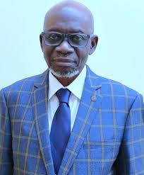

# README

About Major General S.A. Awosanya (Rtd)
Major General S.A. Awosanya (Rtd) is the founder of Aletheia University in Ago-Iwoye, Ogun State, Nigeria. He serves as the university's Chancellor and Chairman of the Board of Trustees.

Key Highlights
- Founder of Aletheia University
- Chancellor and Chairman of the Board of Trustees
- Visionary leader emphasizing sustainability and innovation in Nigerian education

More Information
For more insights into his vision, refer to his address at the International Institute of Tropical Agriculture (IITA), where he shared his aspirations for Aletheia University's transformative impact.